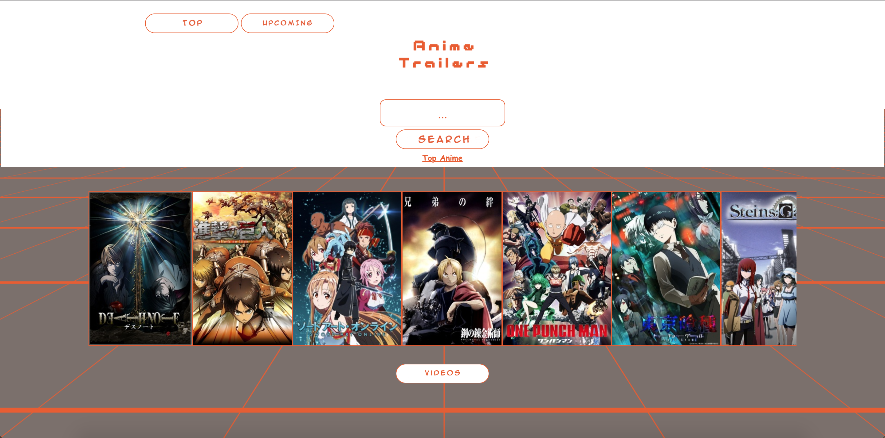
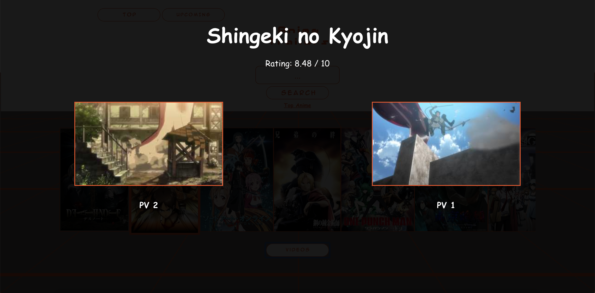
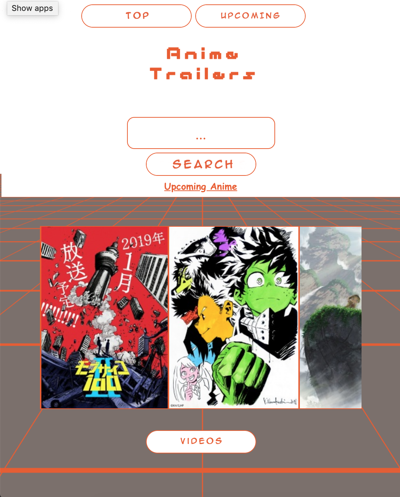

# ANIME TRAILERS

## Inspiration

Sometimes I struggle finding new anime to dive into watching that interests me and im sure its a problem for other fans of anime as well, so I  wanted to create a web page that let me explore new and current anime and get a preview of it right on the spot. Instead of having to go search the web for trailers and promos and having to deal with finding the right season Its all available right in this web app.

## Description 

This web app allows the user to select from top or upcoming animes and pulls up a series of trailers or promo videos straight into the browser where they can preview the anime. It also allows them to search for animes by name.

## Screenshots
Landing page:

Trailer viewing page:

Responsive Layout: 

## Demo

- [Live Demo](https://takaitech.github.io/ANIME-TRAILERS/)

## Technology 
-HTML
-CSS
-JavaScript
-jQuery

## APIs Used

Jikan Rest API:
- []https://jikan.docs.apiary.io/
